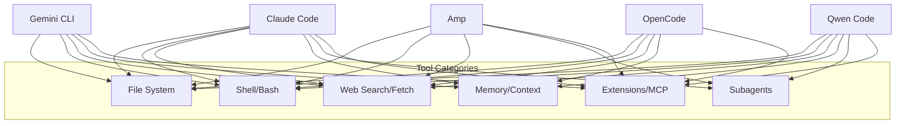

# Coding Agent CLI Comparison & Suggestions for Building a Superior Agent

**Analysis Date:** January 1, 2026  
**Compared Agents:** Claude Code, Gemini CLI, Amp, OpenCode, Qwen Code

---

## Executive Summary

After analyzing five leading coding agent CLI tools, each demonstrates unique architectural strengths. **No single agent is universally "superior"**—the best choice depends on specific needs. However, patterns emerge that define what makes an excellent coding agent.

### Quick Verdict

| Criteria | Winner | Runner-Up |
|----------|--------|-----------|
| **Most Popular/Mature** | Gemini CLI (89.3k ⭐) | Claude Code (50.2k ⭐) |
| **Best Plugin Ecosystem** | Claude Code | OpenCode |
| **Most Open/Flexible** | OpenCode | Amp |
| **Best Multi-Model Strategy** | Amp | Gemini CLI |
| **Best Context Management** | Amp | Claude Code |
| **Best Enterprise Features** | Gemini CLI | Claude Code |
| **Best Free Tier** | Qwen Code (2K/day) | Gemini CLI (1K/day OAuth) |
| **Most Innovative Architecture** | Amp | OpenCode |

---

## Detailed Comparison

### 1. Core Architecture

| Agent | Language | Architecture Pattern | Package Structure |
|-------|----------|---------------------|-------------------|
| **Claude Code** | Shell/Python/TypeScript | ReAct + Plugin System | Monolithic with plugins |
| **Gemini CLI** | TypeScript (98.2%) | CLI/Core separation | Two-package modular |
| **Amp** | N/A (documented concepts) | Subagents + Thread-based | LLM + Loop + Tools |
| **OpenCode** | TypeScript (82.4%) | Client/Server | Monorepo with Turborepo |
| **Qwen Code** | TypeScript (95.9%) | CLI/Core separation | Two-package (forked from Gemini) |

**Insights:**
- **Gemini CLI** and **Qwen Code** share architecture (Qwen forked from Gemini)
- **OpenCode's** client/server model enables remote control (unique advantage)
- **Amp's** thread-based approach revolutionizes context management
- **Claude Code's** plugin system is most extensible

---

### 2. Tool Systems



| Tool Feature | Claude Code | Gemini CLI | Amp | OpenCode | Qwen Code |
|--------------|-------------|------------|-----|----------|-----------|
| File Read/Write/Edit | ✅ | ✅ | ✅ | ✅ | ✅ |
| Shell Execution | ✅ | ✅ (interactive) | ✅ | ✅ | ✅ |
| Web Search | ✅ | ✅ (Google grounding) | ✅ | ✅ | ✅ |
| LSP Integration | ✅ | ❌ | ❌ | ✅ (native) | ❌ |
| MCP Support | ✅ | ✅ | ✅ | ❌ | ✅ |
| Subagents | ✅ (background) | ❌ | ✅ (core feature) | ✅ | ✅ |
| Image/PDF Support | ✅ | ✅ (multimodal native) | ❌ | ❌ | ❌ |
| Multi-stage Edit Correction | ❌ | ✅ | ❌ | ❌ | ❌ (inherited) |

**Key Differentiators:**
- **Gemini CLI**: Native Google Search grounding, multimodal-first
- **Claude Code**: LSP tool for code intelligence (go-to-definition, references)
- **Amp**: Subagents with independent context windows (game-changer)
- **OpenCode**: Native LSP support out-of-the-box

---

### 3. Model Support & Free Tiers

| Agent | Primary Model | Free Tier | Context Window |
|-------|---------------|-----------|----------------|
| **Claude Code** | Claude 4.5 (Haiku/Sonnet/Opus) | ❌ (API key only) | ~200K tokens |
| **Gemini CLI** | Gemini 2.5 Pro/Flash | 1K req/day (OAuth) | 1M tokens |
| **Amp** | Claude Opus 4.5 + GPT-5 (Oracle) | Ad-supported "Free Mode" | 200K–1M tokens |
| **OpenCode** | Provider-agnostic (Claude, OpenAI, local) | Via providers | Varies |
| **Qwen Code** | Qwen3-Coder | 2K req/day (OAuth) | Varies |

**Insights:**
- **Gemini CLI's** 1M token context is industry-leading
- **Amp's** multi-model approach (Oracle for complex reasoning) is unique
- **OpenCode** is most flexible—works with any provider
- **Qwen Code** offers best free tier for daily usage

---

### 4. Safety & Permissions

| Feature | Claude Code | Gemini CLI | Amp | OpenCode | Qwen Code |
|---------|-------------|------------|-----|----------|-----------|
| Permission Modes | ask/always_allow/strict | ask/allow/deny per-tool | allow/reject/ask/delegate | ask/always_allow/strict | ask/always_allow/strict |
| Sandboxing | ✅ (Bash sandbox, Linux/Mac) | ✅ (Docker, path validation) | ✅ | ✅ | ✅ (Docker/sandbox-exec) |
| Command Restrictions | Allow/Deny patterns | Allowlist/Blocklist with prefix | Glob pattern matching | ❌ | Inherited from Gemini |
| External Delegation | ❌ | ❌ | ✅ (helper programs) | ❌ | ❌ |
| Data Retention | Limited, no training | Optional telemetry | Zero (Enterprise) | Optional | Local only |

**Key Insight:** **Amp's** external permission delegation is most sophisticated—allows integrating with org-specific security policies.

---

### 5. Context & Memory Management

| Feature | Claude Code | Gemini CLI | Amp | OpenCode | Qwen Code |
|---------|-------------|------------|-----|----------|-----------|
| Context Files | CLAUDE.md | GEMINI.md | AGENTS.md | AGENTS.md | .qwen/ files |
| Auto-compacting | ✅ (3x improvement) | ✅ (compression) | ❌ (handoff instead) | ✅ | ✅ |
| Session Management | ✅ (named sessions) | ✅ (checkpointing) | ✅ (threads + sharing) | ✅ | ✅ |
| Thread Sharing | ❌ | ❌ | ✅ (public/unlisted/private) | ❌ | ❌ |
| Cross-session Memory | ✅ (/memory command) | ✅ (memory_tool) | ✅ (referencing threads) | ❌ | ✅ (save_memory) |

**Innovation Spotlight:** **Amp's** approach of "handoff" instead of compaction is philosophically different—keep threads short and fresh rather than compressing old ones.

---

### 6. Extensibility & Ecosystem

| Feature | Claude Code | Gemini CLI | Amp | OpenCode | Qwen Code |
|---------|-------------|------------|-----|----------|-----------|
| Plugin System | ✅ (12 official + marketplace) | ❌ (custom commands only) | ✅ (toolboxes) | ❌ | ❌ |
| Hooks/Events | ✅ (PreToolUse, PostToolUse, etc.) | ❌ | ❌ | ❌ | ❌ |
| MCP Protocol | ✅ (stdio/SSE/HTTP) | ✅ | ✅ | ❌ | ✅ |
| SDK | TypeScript + Python | ❌ | TypeScript + Python | TypeScript | TypeScript |
| IDE Extensions | VS Code native | VS Code companion | VS Code, Cursor, JetBrains, Neovim | VS Code | VS Code, Zed |
| GitHub Actions | ✅ | ✅ | ❌ | ✅ | ✅ |

**Winner:** **Claude Code** has the most mature plugin ecosystem with event-driven hooks—enables building sophisticated workflows.

---

### 7. Developer Experience

| Feature | Claude Code | Gemini CLI | Amp | OpenCode | Qwen Code |
|---------|-------------|------------|-----|----------|-----------|
| Installation Methods | npm, curl, Homebrew, desktop | npm, Homebrew, Docker | npm, curl | npm, curl, Homebrew, Scoop, Chocolatey, Nix | npm |
| Desktop App | ✅ | ❌ | Extension-based | ✅ (Beta) | ❌ |
| Headless/CI Mode | ✅ | ✅ (stream-json) | ✅ (-x flag) | ✅ | ✅ |
| Keyboard Shortcuts | Extensive (Ctrl+R, etc.) | Standard | Rich TUI | Rich TUI | Standard |
| Syntax Highlighting | ✅ (custom engine) | ✅ | ✅ | ✅ (Shiki) | ✅ |
| Vim Mode | ✅ | ❌ | ✅ | ❌ | ✅ |
| Theme Customization | ✅ | ✅ | ✅ | ✅ (Tailwind) | ✅ |

---

## Overall Rankings

Based on weighted criteria (Architecture: 20%, Tools: 20%, Safety: 15%, Extensibility: 20%, DX: 15%, Free Tier: 10%):

| Rank | Agent | Score | Best For |
|------|-------|-------|----------|
| 1 | **Claude Code** | 88/100 | Enterprise teams, plugin developers, complex workflows |
| 2 | **Gemini CLI** | 85/100 | Large codebases (1M context), Google ecosystem users |
| 3 | **Amp** | 82/100 | Multi-model workflows, sophisticated context management |
| 4 | **OpenCode** | 78/100 | Provider flexibility, LSP-first development, open-source purists |
| 5 | **Qwen Code** | 72/100 | Free tier maximizers, Qwen model enthusiasts |

---

## Suggestions for Building a Superior Coding Agent CLI

Based on the analysis, here are recommendations for building a next-generation coding agent:

### 1. Architecture Recommendations

> [!IMPORTANT]
> **Adopt a modular CLI/Core separation** (like Gemini/Qwen) with **client/server architecture** (like OpenCode).

```
your-agent/
├── packages/
│   ├── cli/           # Terminal UI (replaceable)
│   ├── core/          # Agent logic (reusable)
│   ├── server/        # HTTP/WebSocket server (new)
│   └── sdk/           # TypeScript + Python SDKs
├── plugins/           # Plugin ecosystem
└── tools/             # Built-in tools
```

**Rationale:**
- CLI/Core separation enables multiple frontends (terminal, web, mobile)
- Server component enables remote control and IDE integration
- SDK enables third-party developers to build on your platform

---

### 2. Tool System Design

> [!TIP]
> **Implement a hierarchical tool system with dynamic discovery.**

```typescript
interface Tool {
  name: string
  displayName: string
  description: string  // For LLM
  parameterSchema: JSONSchema
  needsApproval: (params) => boolean  // Dynamic approval
  execute: (params, context) => ToolResult
  // NEW: Self-correction capability
  correctAndRetry?: (error, params) => Promise<CorrectedParams>
}
```

**Must-Have Tools:**
1. File operations (read/write/edit with diff preview)
2. **Multi-stage edit correction** (like Gemini CLI)
3. Shell execution with **interactive mode** (node-pty)
4. **LSP integration** (code intelligence)
5. Web search with grounding
6. **Subagent spawning** (like Amp)
7. Memory/context persistence

**Innovation Opportunity:**
- Integrate **RAG** for semantic code search
- Add **AST-aware editing** for safer refactoring

---

### 3. Multi-Model Strategy

> [!IMPORTANT]
> **Don't be single-model dependent.** Use different models for different tasks.

| Task | Recommended Model Class |
|------|-------------------------|
| Fast exploration | Small/Fast (Haiku, Flash, Qwen-small) |
| Code generation | Balanced (Sonnet, Pro) |
| Complex reasoning | Powerful (Opus, GPT-5) |
| Code review | Specialized reviewer model |
| Embeddings | Dedicated embedding model |

**Implementation:**
```typescript
const modelRouter = {
  'explore': 'fast-model',
  'generate': 'balanced-model', 
  'reason': 'powerful-model',
  'review': 'reviewer-model'
}
```

---

### 4. Context Management Revolution

> [!CAUTION]
> **Context exhaustion is the #1 failure mode for coding agents.**

**Adopt Amp's Philosophy:**
1. Prefer **short, focused threads** over long accumulating ones
2. Use **subagents with independent context** for complex sub-tasks
3. Implement **handoff** (not compaction) for context reset
4. Enable **thread sharing** for collaboration

**Implementation Checklist:**
- [ ] Subagent isolation (fresh context per subagent)
- [ ] Thread handoff with context summary
- [ ] Named session management
- [ ] Cross-session memory persistence
- [ ] Automatic context summarization when approaching limits

---

### 5. Safety & Permissions Framework

> [!WARNING]
> **Security is non-negotiable for production coding agents.**

**Permission System Design:**
```typescript
type PermissionAction = 'allow' | 'ask' | 'reject' | 'delegate'

interface PermissionRule {
  tool: string | RegExp        // Tool pattern matching
  matches?: Record<string, string | string[]>  // Param matching
  action: PermissionAction
  delegateTo?: string         // External program (like Amp)
}
```

**Required Features:**
1. **Granular tool permissions** (per-command, not just per-tool)
2. **External delegation** (for enterprise policy integration)
3. **Sandboxing** (Docker or sandbox-exec)
4. **Audit logging** (what tools ran, with what params)
5. **Data retention policies** (configurable, zero-retention option)

---

### 6. Plugin Ecosystem

> [!TIP]
> **Plugins are the multiplier for your agent's capabilities.**

**Learn from Claude Code's Plugin Structure:**
```
plugin-name/
├── .plugin/
│   └── plugin.json          # Metadata
├── commands/                # Slash commands
├── agents/                  # Specialized subagents
├── skills/                  # Knowledge injection
├── hooks/                   # Event handlers
│   ├── PreToolUse.ts
│   ├── PostToolUse.ts
│   └── SessionStart.ts
└── README.md
```

**Event System:**
```
SessionStart → PermissionRequest → PreToolUse → 
PostToolUse → SubagentStart → SubagentStop → 
PreCompact → SessionEnd → Stop
```

**Marketplace Considerations:**
- Plugin validation/security scanning
- Version management
- Dependency resolution
- Auto-update mechanism

---

### 7. Developer Experience Polish

> [!NOTE]
> **Small UX details compound into major productivity gains.**

**Essential DX Features:**
1. **Rich terminal UI** with syntax highlighting (Shiki or highlight.js)
2. **Vim mode** (optional but appreciated by power users)
3. **Keyboard shortcuts** (history search, toggle modes)
4. **Diff visualization** before file writes
5. **Progress indicators** for long operations
6. **Theme customization** (dark/light modes)
7. **Headless mode** with JSON/streaming output for CI
8. **Desktop app** option for casual users

**Installation Must-Haves:**
- Single-line curl installer
- npm/yarn/bun/pnpm package
- Homebrew formula
- Platform-specific installers (dmg, exe, deb)
- Nix flake for reproducibility

---

### 8. Unique Innovation Opportunities

Based on gaps in current agents:

| Opportunity | Description | Difficulty |
|-------------|-------------|------------|
| **AI Pair Programming Mode** | Real-time collaboration with split context | High |
| **Git-aware Operations** | Automatic commit/branch management based on task | Medium |
| **Project Templates** | Language/framework-specific agent behaviors | Low |
| **Voice Interface** | Audio input for accessibility | Medium |
| **Collaborative Threads** | Team-shared context (like Amp but better) | High |
| **Cost Tracking** | Real-time token/cost display | Low |
| **Offline Mode** | Local model support with graceful degradation | Medium |

---

## For Your GLM-CLI Tool

Specific recommendations for your JBang/Groovy-based GLM-CLI:

### Quick Wins
1. **Add a `GEMINI.md` or `GLM.md` context file system**
2. **Implement multi-stage edit correction** for robust file edits
3. **Add subagent support** using GLM's API for parallel tasks
4. **Create a plugin system** in Groovy (scripts in `~/.glm/plugins/`)

### Architecture Improvements
1. **Separate CLI from Core** into distinct source files
2. **Add a server mode** for IDE/remote integration
3. **Implement MCP client** for external tool connections

### Safety Enhancements
1. **Add permission modes** (ask/allow/strict)
2. **Implement command allowlist/blocklist**
3. **Add sandbox support** via Docker

### JBang-Specific Advantages
- Fast startup (already a strength)
- Single-file distribution
- JVM ecosystem access
- Consider adding **GraalVM native-image** for even faster startup

---

## Conclusion

The ideal coding agent combines:
- **Claude Code's** plugin ecosystem and extensibility
- **Gemini CLI's** 1M context window and multimodal support
- **Amp's** subagent context isolation and multi-model strategy
- **OpenCode's** client/server architecture and provider flexibility
- **Qwen Code's** generous free tier model

Build progressively: start with a solid CLI/Core architecture, add essential tools, implement safety, then grow the plugin ecosystem. Focus on context management—it's the most common failure mode and the biggest opportunity for innovation.

---

*This analysis was generated by comparing architectural documentation for Claude Code, Gemini CLI, Amp, OpenCode, and Qwen Code as of January 1, 2026.*
