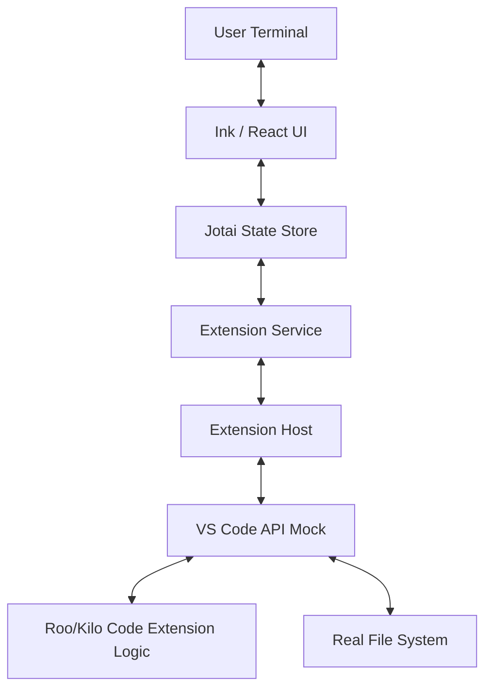

# Kilocode CLI Architecture Analysis

## 1. Executive Summary

The **Kilocode CLI** is a sophisticated terminal-based AI coding assistant that runs a **VS Code Extension** in a headless Node.js environment. Instead of rewriting the agent logic for the CLI, the team created a "Virtual VS Code" host that mocks the VS Code API, allowing the exact same extension code to run in the terminal. The UI is rendered using **Ink** (React for CLI), and state is synchronized between the headless extension and the CLI UI.

## 2. Technical Stack

*   **Language:** TypeScript
*   **Runtime:** Node.js (>=20.19.2)
*   **UI Framework:** [Ink](https://github.com/vadimdemedes/ink) (React-based CLI renderer)
*   **State Management:** [Jotai](https://jotai.org/) (Atomic state management)
*   **CLI Framework:** [Commander](https://github.com/tj/commander.js)
*   **Module Bundling:** Esbuild / Vitest (for testing)
*   **Core Dependencies:**
    *   `@roo-code/*`: Inherits core logic from the Roo Code ecosystem (monorepo structure).
    *   `vscode-mock` (Custom implementation): A comprehensive mock of the VS Code API.

## 3. High-Level Architecture

The architecture follows a **Headless Extension Host** pattern:

### 3.1. The "Virtual VS Code" (Host Layer)

The most innovative part of the architecture is the `host/` directory, which emulates the VS Code runtime.

*   **`ExtensionHost.ts`**:
    *   **Module Interception**: Uses a custom Node.js `require` hook (`Module._resolveFilename` and `Module.prototype._compile`) to intercept imports of `vscode`. It returns the mocked API instead of the real module.
    *   **Console Interception**: Captures `console.log/error` from the extension and redirects them to the CLI's logging service to prevent pollution of the TUI.
    *   **Webview Bridge**: Simulates the `Webview` communication channel. The extension "thinks" it is posting messages to a React webview (the sidebar), but `ExtensionHost` intercepts these messages and emits them as events to the CLI.

*   **`VSCode.ts`**:
    *   Implements a fully functional mock of `vscode.workspace`, `vscode.window`, `vscode.commands`, etc.
    *   **Workspace Edits**: The `WorkspaceAPI.applyEdit` method intercepts document changes and **writes them directly to the file system** using `fs.writeFileSync`. This allows the agent to modify files without a real editor.
    *   **Virtual Documents**: Maintains an in-memory representation of "open text documents" to satisfy the extension's need to read/analyze code.

### 3.2. The User Interface (UI Layer)

*   **Technology**: Built with **Ink** (React).
*   **Structure**:
    *   `cli/src/ui/`: Contains React components for the terminal (e.g., `App.tsx`, `Chat`, `Input`).
    *   **Message Routing**: The UI listens to the `ExtensionService` for messages (e.g., `say`, `ask`) and renders them as chat bubbles or interactive prompts.
    *   **Input Handling**: User input from the terminal is packaged as a "webview message" and sent *down* to the extension, mimicking a user typing in the VS Code sidebar.

### 3.3. State Management

*   **Jotai Atoms**: State is managed using `atoms` in `cli/src/state/`.
*   **Synchronization**: The state is bi-directional.
    *   **Upstream**: When the extension changes state (e.g., new chat message), `ExtensionHost` emits an event -> `ExtensionService` updates Jotai atoms -> UI re-renders.
    *   **Downstream**: When the user interacts (e.g., types a command), the UI updates atoms -> sends message to `ExtensionHost` -> Extension processes input.

## 4. Key Workflows

### 4.1. Initialization
1.  `src/index.ts` parses CLI args and initializes `CLI`.
2.  `CLI` creates `ExtensionService`.
3.  `ExtensionService` creates `ExtensionHost`.
4.  `ExtensionHost` loads the `vscode-mock` and requires the extension bundle (headless).
5.  `ExtensionHost` calls the extension's `activate()` method.

### 4.2. File Modification
1.  The Extension logic decides to edit a file.
2.  It calls `vscode.workspace.applyEdit(workspaceEdit)`.
3.  The mocked `VSCode.ts` receives this call.
4.  It iterates through the changes and uses `fs.writeFileSync` to update the actual file on disk.

### 4.3. Parallel / Sandbox Mode
*   The CLI supports a `--parallel` flag.
*   The `ParallelExecutor` (implied from file names) creates a **git worktree** or a separate branch for the agent to work in.
*   This provides a safe sandbox where the agent can make changes without affecting the user's current working state until verified.

## 5. Architectural Strengths

1.  **Code Reuse**: They reuse 100% of their complex agent logic (Roo Code) without rewriting it for CLI.
2.  **Consistency**: The CLI behaves *exactly* like the VS Code extension because it *is* the VS Code extension running in a simulated environment.
3.  **Robustness**: By mocking the API layer rather than the logic layer, they avoid "drift" where the CLI version lags behind the extension features.

## 6. Directory Map

*   `cli/src/host/`: The Virtual VS Code environment (Critical).
*   `cli/src/services/extension.ts`: Bridge between CLI and Host.
*   `cli/src/ui/`: Ink/React components.
*   `cli/src/state/`: Jotai state definitions.
*   `cli/src/commands/`: Standard CLI command handlers (non-interactive mode).
