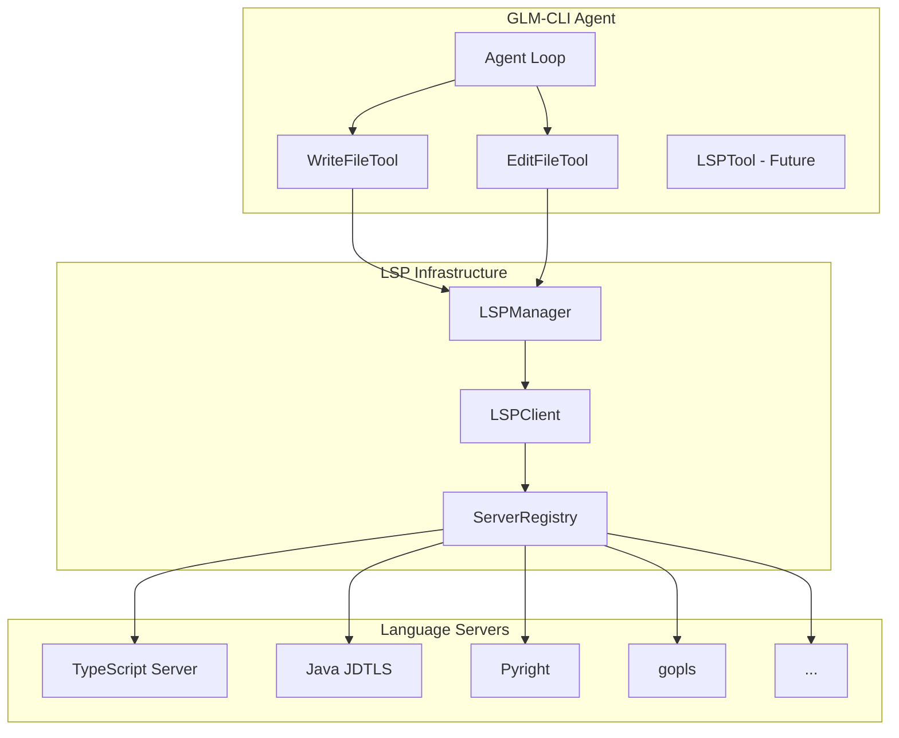
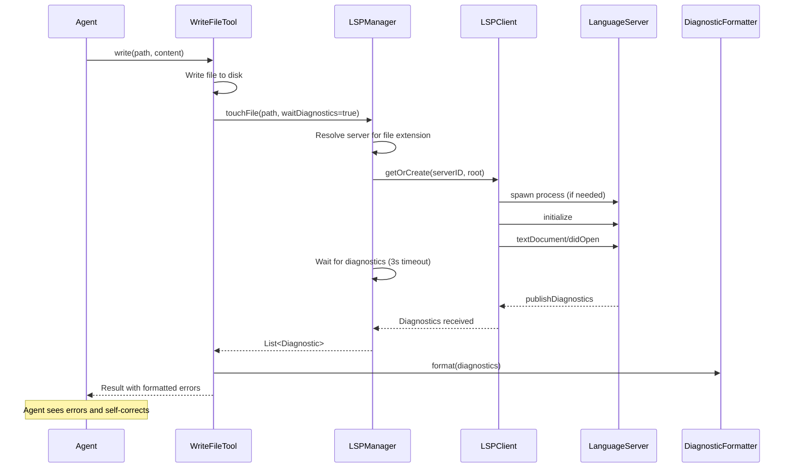

# LSP Implementation Plan for GLM-CLI

This document outlines the implementation plan for adding Language Server Protocol (LSP) support to GLM-CLI, inspired by [sst/opencode](https://github.com/sst/opencode).

## Overview

LSP integration enables the AI agent to receive real-time diagnostics (errors, warnings) after code modifications, allowing for iterative self-correction and higher code quality.



## Architecture

### Core Components

| Component | File | Responsibility |
|-----------|------|----------------|
| `LSPManager` | `core/LSPManager.groovy` | Singleton managing all LSP clients and server lifecycle |
| `LSPClient` | `core/LSPClient.groovy` | JSON-RPC communication with a single LSP server |
| `ServerRegistry` | `core/LSPServerRegistry.groovy` | Server definitions, auto-spawn, root detection |
| `DiagnosticFormatter` | `core/DiagnosticFormatter.groovy` | Format diagnostics for agent consumption |

### Data Flow



## Implementation Phases

### Phase 1: Core Infrastructure (Priority: High)

**Goal:** Establish basic LSP communication framework.

#### 1.1 JSON-RPC Protocol Handler

```groovy
// core/JsonRpcHandler.groovy
class JsonRpcHandler {
    private final Process process
    private final InputStream inputStream
    private final OutputStream outputStream
    private final Map<Integer, CompletableFuture> pendingRequests = [:]
    private int requestId = 0
    
    // Send request and wait for response
    Object sendRequest(String method, Map params, long timeoutMs = 5000)
    
    // Send notification (no response expected)
    void sendNotification(String method, Map params)
    
    // Handle incoming messages (responses + notifications)
    void startMessageLoop()
}
```

#### 1.2 LSP Client

```groovy
// core/LSPClient.groovy
class LSPClient {
    private final JsonRpcHandler rpc
    private final Map<String, List<Diagnostic>> diagnostics = [:]
    private final Map<String, Integer> fileVersions = [:]
    
    // Initialize connection with server
    Map initialize(String rootPath)
    
    // File operations
    void didOpen(String filePath, String content)
    void didChange(String filePath, String content)
    void didClose(String filePath)
    
    // Queries (Phase 3)
    List<Location> goToDefinition(String file, int line, int character)
    List<Location> findReferences(String file, int line, int character)
    
    // Diagnostics
    List<Diagnostic> getDiagnostics(String filePath)
    void waitForDiagnostics(long timeoutMs = 3000)
}
```

#### 1.3 LSP Manager

```groovy
// core/LSPManager.groovy
@Singleton
class LSPManager {
    private final Map<String, LSPClient> clients = [:]  // key: "${serverID}:${root}"
    private final Set<String> brokenServers = []
    
    // Get or create client for file
    LSPClient getClient(String filePath)
    
    // Touch file and optionally wait for diagnostics
    List<Diagnostic> touchFile(String filePath, boolean waitForDiagnostics)
    
    // Get all diagnostics across all clients
    Map<String, List<Diagnostic>> getAllDiagnostics()
    
    // Shutdown all servers
    void shutdown()
}
```

### Phase 2: Server Registry (Priority: High)

**Goal:** Support common language servers with auto-spawn.

#### 2.1 Server Definition

```groovy
// core/LSPServerRegistry.groovy
class LSPServerConfig {
    String id
    List<String> command
    List<String> extensions
    Map<String, String> env = [:]
    Map initializationOptions = [:]
    Closure<String> rootDetector  // Returns project root
}

class LSPServerRegistry {
    private static final Map<String, LSPServerConfig> BUILTIN_SERVERS = [
        'typescript': new LSPServerConfig(
            id: 'typescript',
            command: ['npx', 'typescript-language-server', '--stdio'],
            extensions: ['.ts', '.tsx', '.js', '.jsx'],
            rootDetector: { dir -> findNearestFile(dir, 'package.json', 'tsconfig.json') }
        ),
        'java': new LSPServerConfig(
            id: 'java',
            command: ['jdtls'],  // Requires manual install
            extensions: ['.java'],
            rootDetector: { dir -> findNearestFile(dir, 'pom.xml', 'build.gradle', 'settings.gradle') }
        ),
        'groovy': new LSPServerConfig(
            id: 'groovy',
            command: ['groovy-language-server'],
            extensions: ['.groovy'],
            rootDetector: { dir -> findNearestFile(dir, 'build.gradle', 'settings.gradle') }
        ),
        'python': new LSPServerConfig(
            id: 'python',
            command: ['pyright-langserver', '--stdio'],
            extensions: ['.py'],
            rootDetector: { dir -> findNearestFile(dir, 'pyproject.toml', 'setup.py', 'requirements.txt') }
        ),
        'go': new LSPServerConfig(
            id: 'go',
            command: ['gopls'],
            extensions: ['.go'],
            rootDetector: { dir -> findNearestFile(dir, 'go.mod') }
        ),
        'rust': new LSPServerConfig(
            id: 'rust',
            command: ['rust-analyzer'],
            extensions: ['.rs'],
            rootDetector: { dir -> findNearestFile(dir, 'Cargo.toml') }
        )
    ]
    
    // Find server config for file
    LSPServerConfig getServerForFile(String filePath)
    
    // Spawn server process
    Process spawn(LSPServerConfig config, String root)
}
```

#### 2.2 Root Detection

```groovy
// core/RootDetector.groovy
class RootDetector {
    // Find nearest directory containing any of the marker files
    static String findNearestFile(String startDir, String... markers) {
        Path current = Paths.get(startDir).toAbsolutePath()
        while (current != null) {
            for (String marker : markers) {
                if (Files.exists(current.resolve(marker))) {
                    return current.toString()
                }
            }
            current = current.parent
        }
        return startDir  // Fallback to start directory
    }
    
    // Find git root
    static String findGitRoot(String startDir)
}
```

### Phase 3: Tool Integration (Priority: High)

**Goal:** Integrate LSP diagnostics into file modification tools.

#### 3.1 Update WriteFileTool

```groovy
// tools/WriteFileTool.groovy (modified)
class WriteFileTool implements Tool {
    Object execute(Map<String, Object> args) {
        String path = args.path
        String content = args.content
        
        // Write file
        Files.writeString(Paths.get(path), content)
        
        // Touch file in LSP and wait for diagnostics
        def lsp = LSPManager.instance
        def diagnostics = lsp.touchFile(path, true)
        
        // Format result
        StringBuilder result = new StringBuilder()
        result.append("Successfully wrote ${content.length()} bytes to ${path}")
        
        if (diagnostics && !diagnostics.isEmpty()) {
            def errors = diagnostics.findAll { it.severity == 1 }
            if (errors) {
                result.append("\n\nThis file has errors, please fix:")
                result.append("\n<file_diagnostics>")
                errors.take(20).each { diag ->
                    result.append("\n${DiagnosticFormatter.format(diag)}")
                }
                if (errors.size() > 20) {
                    result.append("\n... and ${errors.size() - 20} more")
                }
                result.append("\n</file_diagnostics>")
            }
        }
        
        return result.toString()
    }
}
```

#### 3.2 Diagnostic Formatter

```groovy
// core/DiagnosticFormatter.groovy
class DiagnosticFormatter {
    private static final Map<Integer, String> SEVERITY = [
        1: 'ERROR',
        2: 'WARNING', 
        3: 'INFO',
        4: 'HINT'
    ]
    
    static String format(Diagnostic diag) {
        def severity = SEVERITY[diag.severity] ?: 'UNKNOWN'
        def line = diag.range.start.line + 1  // Convert to 1-based
        def col = diag.range.start.character + 1
        return "${severity} [${line}:${col}] ${diag.message}"
    }
    
    static String formatAll(List<Diagnostic> diagnostics, int limit = 20) {
        def formatted = diagnostics.take(limit).collect { format(it) }.join('\n')
        if (diagnostics.size() > limit) {
            formatted += "\n... and ${diagnostics.size() - limit} more"
        }
        return formatted
    }
}
```

### Phase 4: Configuration (Priority: Medium)

**Goal:** Allow users to configure LSP behavior.

#### 4.1 Configuration Schema

```json
// ~/.glm/config.json
{
  "lsp": {
    "enabled": true,
    "diagnosticTimeout": 3000,
    "servers": {
      "typescript": {
        "disabled": false
      },
      "custom-server": {
        "command": ["my-lsp", "--stdio"],
        "extensions": [".myext"],
        "env": {
          "MY_VAR": "value"
        }
      }
    }
  }
}
```

#### 4.2 Configuration Reader

```groovy
// core/LSPConfig.groovy
class LSPConfig {
    boolean enabled = true
    int diagnosticTimeout = 3000
    Map<String, ServerConfig> servers = [:]
    
    static LSPConfig load() {
        def configPath = Paths.get(System.getProperty("user.home"), ".glm", "config.json")
        if (Files.exists(configPath)) {
            def json = new JsonSlurper().parse(configPath.toFile())
            // Parse and return config
        }
        return new LSPConfig()  // Default
    }
}
```

### Phase 5: LSP Query Tool (Priority: Low - Experimental)

**Goal:** Allow agent to query code intelligence directly.

```groovy
// tools/LSPTool.groovy
class LSPTool implements Tool {
    String name = "lsp"
    String description = """Query language server for code intelligence.
    
Operations:
- goToDefinition: Find where a symbol is defined
- findReferences: Find all references to a symbol
- hover: Get type/documentation info
- documentSymbol: List all symbols in a file
"""
    
    Object execute(Map<String, Object> args) {
        String operation = args.operation
        String filePath = args.filePath
        int line = args.line - 1  // Convert to 0-based
        int character = args.character - 1
        
        def client = LSPManager.instance.getClient(filePath)
        
        switch (operation) {
            case 'goToDefinition':
                return client.goToDefinition(filePath, line, character)
            case 'findReferences':
                return client.findReferences(filePath, line, character)
            case 'hover':
                return client.hover(filePath, line, character)
            case 'documentSymbol':
                return client.documentSymbol(filePath)
            default:
                return "Unknown operation: ${operation}"
        }
    }
}
```

## File Structure

```
glm-cli-jbang/
├── core/
│   ├── LSPManager.groovy          # Singleton managing all LSP clients
│   ├── LSPClient.groovy           # Communication with single LSP server
│   ├── LSPServerRegistry.groovy   # Server definitions and spawning
│   ├── JsonRpcHandler.groovy      # JSON-RPC protocol implementation
│   ├── DiagnosticFormatter.groovy # Format diagnostics for output
│   ├── RootDetector.groovy        # Find project roots
│   └── LSPConfig.groovy           # Configuration handling
├── tools/
│   ├── WriteFileTool.groovy       # Modified to include diagnostics
│   ├── EditFileTool.groovy        # Modified to include diagnostics (if exists)
│   └── LSPTool.groovy             # Direct LSP queries (experimental)
└── models/
    └── Diagnostic.groovy          # Diagnostic data class
```

## Implementation Timeline

| Phase | Duration | Deliverable |
|-------|----------|-------------|
| Phase 1 | 1 week | Core LSP infrastructure (JSON-RPC, Client, Manager) |
| Phase 2 | 1 week | Server registry with TypeScript, Java, Python, Go support |
| Phase 3 | 3 days | Tool integration with diagnostic feedback |
| Phase 4 | 2 days | Configuration system |
| Phase 5 | 1 week | Experimental LSP query tool |

## Dependencies

Add to JBang script header:

```groovy
//DEPS com.google.code.gson:gson:2.10.1  // JSON handling (if not already present)
```

No external LSP library needed - we implement JSON-RPC directly over stdio.

## Supported Language Servers (Initial)

| Language | Server | Auto-Install | Command |
|----------|--------|--------------|---------|
| TypeScript/JavaScript | typescript-language-server | Yes (npx) | `npx typescript-language-server --stdio` |
| Java | Eclipse JDTLS | No | `jdtls` |
| Groovy | groovy-language-server | No | `groovy-language-server` |
| Python | Pyright | Yes (npx) | `npx pyright-langserver --stdio` |
| Go | gopls | Yes (go install) | `gopls` |
| Rust | rust-analyzer | No | `rust-analyzer` |

## Testing Strategy

1. **Unit Tests**: Test JSON-RPC encoding/decoding, root detection
2. **Integration Tests**: Test with actual TypeScript server on sample project
3. **Manual Tests**: Test with agent loop doing real coding tasks

## Risk Mitigation

| Risk | Mitigation |
|------|------------|
| Server crashes | Track broken servers, skip after 3 failures |
| Slow diagnostics | Timeout after 3s, return partial results |
| Missing servers | Graceful degradation - just skip LSP feedback |
| Memory leaks | Implement proper shutdown, limit active clients |

## Success Criteria

1. ✅ Agent receives immediate diagnostic feedback after file writes
2. ✅ Support for at least 4 language servers (TypeScript, Java, Python, Go)
3. ✅ Configurable via `~/.glm/config.json`
4. ✅ Graceful degradation when servers unavailable
5. ✅ Agent can self-correct based on diagnostic feedback

## References

- [LSP Specification](https://microsoft.github.io/language-server-protocol/specifications/lsp/3.17/specification/)
- [sst/opencode LSP Implementation](https://github.com/sst/opencode/tree/main/packages/opencode/src/lsp)
- [vscode-jsonrpc](https://github.com/microsoft/vscode-languageserver-node/tree/main/jsonrpc) (Protocol reference)
